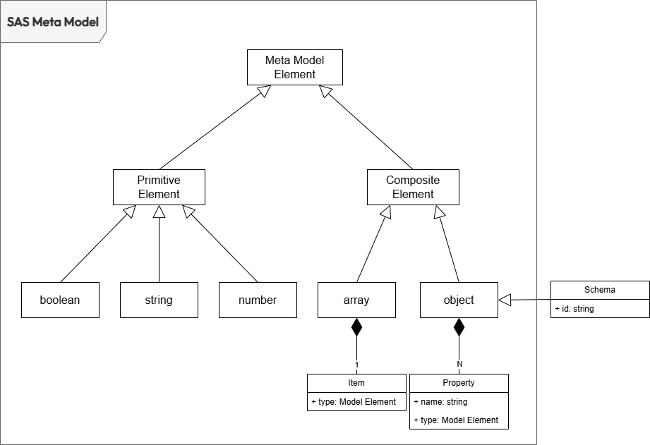

# Schema Annotations Specification

## Introduction

The Schema Annotation Specification (SAS) defines a set of standard annotations to describe entities and properties within a data schema. The annotations are independent of the schema definition language used. They can therefore be applied alongside any schema definition language that supports annotations (e.g., JSON Schema, Avro Schema, Protobuf, XSD, etc.).

Defining schema annotations through an open specification is useful for:

- Add descriptive metadata directly within the schema used to describe how data is structured and encoded. 
- Developers can use the schema specification language they prefer and embed in it metadata without having to learn a separate formalization to specify them
- Wherever the schema is used also the metadata are available
- The tools that extract metadata from the schema can leverage standardized semantics to interpret their meaning and use them in the proper way

## Conventions and Terminology
The keywords "MUST", "MUST NOT", "REQUIRED", "SHALL", "SHALL NOT", "SHOULD", "SHOULD NOT", "RECOMMENDED", "NOT RECOMMENDED", "MAY", and "OPTIONAL" in this document are to be interpreted as described in <a href="https://tools.ietf.org/html/bcp14" target="_blank">BCP 14:octicons-link-external-24:</a> <a href="https://tools.ietf.org/html/rfc2119" target="_blank">RFC2119:octicons-link-external-24:</a> <a href="https://tools.ietf.org/html/rfc8174" target="_blank">RFC8174:octicons-link-external-24:</a> when, and only when, they appear in all capitals, as shown here.

## License
This document is licensed under <a href="https://www.apache.org/licenses/LICENSE-2.0.html" target="_blank">The Apache License, Version 2.0:octicons-link-external-24:</a>.

## Table of Contents

- [Schema Annotations Specification](#schema-annotations-specification)
	- [Introduction](#introduction)
	- [Conventions and Terminology](#conventions-and-terminology)
	- [License](#license)
	- [Table of Contents](#table-of-contents)
	- [Definitions](#definitions)
		- [Standard](#standard)
		- [Standard Specification](#standard-specification)
		- [Standard Definition](#standard-definition)
		- [Schema](#schema)
		- [Schema Definition Language](#schema-definition-language)
		- [Schema Annotation](#schema-annotation)
		- [Schema Document](#schema-document)
		- [SAS Specification](#sas-specification)
	- [Specification](#specification)
		- [Versions](#versions)
		- [Data Types](#data-types)
		- [Rich Text Formatting](#rich-text-formatting)
		- [Relative References in URLs](#relative-references-in-urls)
		- [Meta Model](#meta-model)
		- [Schema Definition Language](#schema-definition-language-1)
			- [JSON Schema](#json-schema)
			- [Avro Schema](#avro-schema)
			- [Protobuf](#protobuf)
			- [XSD](#xsd)
		- [Keywords](#keywords)
		- [Vocabularies](#vocabularies)
		- [The "sasDialects" Keyword](#the-sasdialects-keyword)
		- [Default vocabularies](#default-vocabularies)
	- [Basic Meta-Data Annotations Vacabulary](#basic-meta-data-annotations-vacabulary)
		- [Keywords applicable to schema or properties](#keywords-applicable-to-schema-or-properties)
			- [title](#title)
			- [description](#description)
			- [default](#default)
			- [deprecated](#deprecated)
		- [Keywords applicable only to properties](#keywords-applicable-only-to-properties)
			- [writeOnly](#writeonly)
			- [writeOnly](#writeonly-1)
	- [Logical Meta-Data Annotations Vacabulary](#logical-meta-data-annotations-vacabulary)
		- [Keywords applicable to schema or properties](#keywords-applicable-to-schema-or-properties-1)
			- [summary](#summary)
			- [modelRole](#modelrole)
			- [tags](#tags)
			- [externalDocs](#externaldocs)
		- [Keywords applicable only to schema](#keywords-applicable-only-to-schema)
			- [owner](#owner)
			- [domain](#domain)
			- [schemaType](#schematype)
			- [modellingStyle](#modellingstyle)
			- [contactPoints](#contactpoints)
			- [status](#status)
		- [Keywords applicable only to properties](#keywords-applicable-only-to-properties-1)
			- [primaryKey](#primarykey)
			- [primaryKeyPosition](#primarykeyposition)
			- [validityTime](#validitytime)
			- [creationTime](#creationtime)
			- [lastUpdateTime](#lastupdatetime)
			- [deletionTime](#deletiontime)
			- [sequenceKey](#sequencekey)
			- [watermarkKey](#watermarkkey)
	- [Physical Meta-Data Annotations Vacabulary](#physical-meta-data-annotations-vacabulary)
		- [Keywords applicable to schema or properties](#keywords-applicable-to-schema-or-properties-2)
			- [physicalName](#physicalname)
			- [physicalType](#physicaltype)
		- [Keywords applicable only to properties](#keywords-applicable-only-to-properties-2)
			- [partitionKey](#partitionkey)
			- [partitionKeyPosition](#partitionkeyposition)
	- [Structural Validtion Vacabulary](#structural-validtion-vacabulary)
		- [Keywords applicable to any properties](#keywords-applicable-to-any-properties)
			- [type](#type)
			- [enum](#enum)
			- [const](#const)
		- [Keywords applicable to numeric properties](#keywords-applicable-to-numeric-properties)
			- [multipleOf](#multipleof)
			- [maximum](#maximum)
			- [exclusiveMaximum](#exclusivemaximum)
			- [minimum](#minimum)
			- [exclusiveMinimum](#exclusiveminimum)
		- [Keywords applicable to string properties](#keywords-applicable-to-string-properties)
			- [maxLength](#maxlength)
			- [minLength](#minlength)
			- [pattern](#pattern)
		- [Keywords applicable to array properties](#keywords-applicable-to-array-properties)
			- [maxItems](#maxitems)
			- [minItems](#minitems)
			- [maxContains](#maxcontains)
			- [minContains](#mincontains)
		- [Keywords applicable to object properties](#keywords-applicable-to-object-properties)
			- [maxProperties](#maxproperties)
			- [minProperties](#minproperties)
			- [required](#required)
			- [dependentRequired](#dependentrequired)
	- [String-encoded Content Vacabulary](#string-encoded-content-vacabulary)
		- [Keywords applicable to string properties](#keywords-applicable-to-string-properties-1)
			- [contentEncoding](#contentencoding)
			- [contentMediaType](#contentmediatype)
			- [contentSchema](#contentschema)
	- [Format Annotation Vacabulary](#format-annotation-vacabulary)
		- [Keywords applicable to string properties](#keywords-applicable-to-string-properties-2)
			- [format](#format)
	- [Syntactic Link Annotations Vacabulary](#syntactic-link-annotations-vacabulary)
	- [Semantic Link Annotations Vacabulary](#semantic-link-annotations-vacabulary)
	- [Quality Annotation Vacabulary](#quality-annotation-vacabulary)
- [Appendix A: Revision History](#appendix-a-revision-history)


## <a name="definitions"></a>Definitions

### <a name="definitionsStandard"></a>Standard
The set of shared rules used by different agents to describe an entity or process of common interest. By conforming to these rules, agents limit their autonomy to enable interoperability, allowing for smoother cooperation.

### <a name="definitionsSpecification"></a>Standard Specification
The formal description of the rules that form a [standard](#definitionsStandard). A standard can have multiple specification versions associated with it. Sometimes the words standard and specification are used as synonymous. 

### <a name="definitionsDefinition"></a>Standard Definition
The description of one specific entity or process created using and conforming to the set of rules formally described in the [standard specification](#definitionsSpecification)

### <a name="definitionsSchema"></a>Schema
A schema is a machine-readable description of the structure of a dataset. It can be used to validate the structure of a dataset, to decide how to query it, and to encode the results.

### <a name="definitionsSchemaDefinitionLanguage"></a>Schema Definition Language
A schema definition language is the formalism used to describe the schema of a dataset (es. JSON Schema, Avro Schema, Protobub, XML Schema, etc...)

### <a name="definitionsSchemaAnnotation"></a>Schema Annotation
A schema annotation is a piece of information embedded in the schema definition to add metadata related to a specific part of the structure. The annotation is not directly used for validating or encoding the data.

### <a name="definitionsSchemaDocument"></a>Schema Document
The document (or set of documents) that contains the schema definition.

### <a name="definitionsSAS"></a>SAS Specification
The list of standard annotations that can be used describes the different parts of the schema defined in a [Schema Document](definitionsSchemaDocument).


## <a name="specification"></a>Specification

### <a name="versions"></a>Versions

The Schema Annotation Specification is versioned using <a href="https://semver.org/spec/v2.0.0.html)" target="_blank">Semantic Versioning 2.0.0:octicons-link-external-24:</a> (semver) and follows the semver specification.

The `major`.`minor` portion of the semver (for example `1.0`) SHALL designate the DPDS feature set. Typically, *`.patch`* versions address errors in this document, not the feature set. Tooling which supports SAS 1.0 SHOULD be compatible with all SAS 1.0.\* versions. The patch version SHOULD NOT be considered by tooling, making any distinction between `1.0.0` and `1.0.1` for example.

Each new minor version of the SAS Specification SHALL allow any schema document that is valid against any previous minor version of the Specification, within the same major version, to be updated to the new Specification version with equivalent semantics. Such an update MUST only require changing the `xxx` property to the new minor version.

For example, a valid schema document annotated using SAS 1.0.2, upon changing its `xxx` property to `1.1.0`, SHALL be a valid schema document annotated with SAS 1.1.0, semantically equivalent to the original schema document. New minor versions of the Schema Annotation Specification MUST be written to ensure this form of backward compatibility.

### <a name="dataTypes"></a>Data Types

Primitive data types in the SAS are based on the types supported by the <a href="https://json-schema.org/draft/2020-12/json-schema-core.html#name-instance" target="_blank">JSON Schema Specification:octicons-link-external-24:</a>. 


<a name="dataTypeFormat"></a>Primitives have an optional modifier property: `format`.
DPDS uses several known formats to define in fine detail the data type being used.
However, to support documentation needs, the `format` property is an open `string`-valued property and can have any value.
Formats such as `"email"`, `"uuid"`, and so on, MAY be used even though undefined by this specification.
Types that are not accompanied by a `format` property follow the type definition in the JSON Schema. Tools that do not recognize a specific `format` MAY default back to the `type` alone as if the `format` is not specified.

The formats defined by the DPDS are:

[`type`](#dataTypes) | [`format`](#dataTypeFormat) | Comments
------ | -------- | --------
`integer` | `int32` | signed 32 bits
`integer` | `int64` | signed 64 bits (a.k.a long)
`number` | `float` | |
`number` | `double` | |
`string` | | |
`string` | `alphanumeric` | a string that match the following regex `^[a-zA-Z0-9]+$`
`string` | `name` | a string that match the following regex `^[a-zA-Z][a-zA-Z0-9]+$`
`string` | `fqn` | a string that match the following regex `^[a-zA-Z][a-zA-Z0-9.:]+$`
`string` | `version` | a string that match the following regex `^(0|[1-9]\d*)\.(0|[1-9]\d*)\.(0|[1-9]\d*)(?:-((?:0|[1-9]\d*|\d*[a-zA-Z-][0-9a-zA-Z-]*)(?:\.(?:0|[1-9]\d*|\d*[a-zA-Z-][0-9a-zA-Z-]*))*))?(?:\+([0-9a-zA-Z-]+(?:\.[0-9a-zA-Z-]+)*))?$`
`string` | `byte` | base64 encoded characters
`string` | `binary` | any sequence of octets
`string` | `uuid` | a sequence of 16 octets as defined by <a href="https://www.rfc-editor.org/rfc/rfc4122.html" target="_blank">RFC4122:octicons-link-external-24:</a>
`boolean` | | |
`string` | `date` | As defined by `full-date` - <a href="https://www.rfc-editor.org/rfc/rfc3339" target="_blank">RFC3339:octicons-link-external-24:</a>
`string` | `date-time` | As defined by `date-time` - <a href="https://www.rfc-editor.org/rfc/rfc3339" target="_blank">RFC3339:octicons-link-external-24:</a>
`string` | `password` | A hint to UIs to obscure input.
`string` | `uri` |  a string that match the following regex `^(([^:/?#]+):)?(//([^/?#]*))?([^?#]*)(\?([^#]*))?(#(.*))?`


### <a name="richText"></a>Rich Text Formatting
Throughout the specification `description` fields are noted as supporting CommonMark markdown formatting.
An annotations consumer SHOULD support, at a minimum, markdown syntax as described by <a href="https://spec.commonmark.org/0.27/" target="_blank">CommonMark 0.27:octicons-link-external-24:</a>. Consumers MAY choose to ignore some CommonMark features to address security concerns. 

### <a name="relativeReferences"></a>Relative References in URLs

Unless specified otherwise, all annotations that are URLs SHOULD be absolute references. If an annotation explicitly specifies in its description that allows a relative reference its value MUST be compliant with <a href="https://tools.ietf.org/html/rfc3986#section-4.2" target="_blank">RFC3986:octicons-link-external-24:</a>. Relative references MUST be resolved using the URLs defined in the property description as a Base URI.

Relative references used in `$ref` are processed as per <a href="https://tools.ietf.org/html/draft-pbryan-zyp-json-ref-03" target="_blank">JSON Reference:octicons-link-external-24:</a>, using the URL of the current document as the base URI. 


### <a name="metaModel"></a>Meta Model

A dataset is a structured collection of data. Each entry within the dataset adheres to the same structure, which is referred to as its **data model**. The data model defines how data within each entry are arranged and related. 

A **meta model** provides the framework for defining the data model of a dataset. In SAS, the meta model describes the structure of a dataset entry as an `object` (i.e. root object or schema) consisting of an unordered list of named properties. 



Each property represents a portion of the data within a dataset entry and can take one of two forms:

- **Primitive Properties:** When a property’s type is a primitive element of the meta model (e.g., `boolean`, `number`, `string`), it describes a single, specific data point within the entry.

- **Composite Properties:** When a property’s type is a composite element of the meta model (e.g., `array`, `object`), it describes a nested collection of data points within the parent entry.

A data model consisting only of primitive properties is said to have a **tabular structure**, while one that incorporates composite properties is described as having a **document structure**. 

### <a name="schemaDefinitionLanguage"></a>Schema Definition Language

A **schema** is a machine-readable representation of a data model defined using a specific **Schema Definition Language (SDL)**. Each SDL is grounded in a foundational meta-model that shapes the keywords and syntax the language uses to describe the schema of a specific data model.

Keywords used by an SDL can be divided into three main categories:

- **Core keywords**: These define the basic structure of the data model. For example, in JSON Schema, keywords like `$id`, `object`, `properties`, `string`, `number`, and `boolean` are used to shape the model.

- **Functional keywords**: These are reserved keywords that trigger specific actions in the supporting tools. Their behavior depends on the context in which the SDL is defined. In most DSLs, functional keywords are used to validate schema instances (i.e., entries in the dataset). For example, in JSON Schema, the keyword `required` specifies which properties are mandatory in an object.

- **Annotation keywords**: These keywords are not reserved and don’t trigger any specific behavior. Instead, they provide additional information to enhance the data model (metadata). For example, in JSON Schema, the `description` keyword is used to add a textual explanation of a property.
  
SAS specifies how to define and use annotation keywords within any SDL that can describe data models with both tabular and document structures.

#### <a name="sdlJsonSchema"></a>JSON Schema
In JSON Schema any keywords not defined by the spec is considered by default an annotation keyword.

In the following example, `author` and `unit` are annotations. The `author` annotation specifies that *Andrea* created the schema, while the `unit` annotation indicates that the temperatures in the dataset must be expressed in *degrees Celsius*.

```json
{
  "type": "object",

  "author": "Andrea",

  "properties": {
    "temperatures": {
      "type": "array",
      "items": {
        "type": "number",
		"unit": "Celsius"
      },
    },
    "sensor": {
      "type": "object",
      "properties": {
        "id": {
          "type": "string",
        },
        "location": {
          "type": "string",
        }
      },
      "required": ["id", "location"],
    }
  },
  "required": ["temperatures", "sensor"]
}
```

#### <a name="sdlAvroSchema"></a>Avro Schema

In Avro Schema any keywords not defined by the spec is considered by default an annotation keyword.

The following example specify with Avro Schema a data model structure equivalent to the one defined with JSON Schema in the previous section.

```json
{
  "type": "record",
  "name": "TemperatureData",

  "author": "Andrea",

  "fields": [
    {
      "name": "temperatures",
      "type": {
        "type": "array",
        "items": "double",
		"unit": "Celsius"
      }
    },
    {
      "name": "sensor",
      "type": {
        "type": "record",
        "name": "Sensor",
        "fields": [
          {
            "name": "id",
            "type": "string"
          },
          {
            "name": "location",
            "type": "string"
          }
        ]
      }
    }
  ]
}
```

#### <a name="sdlProtoBuf"></a>Protobuf

In Protobuf annotation must be defined trhroug custom options like shown in the following example:

```proto
syntax = "proto3";

// Import custom options from sas-annotations.proto
import "sas-annotations.proto";  

message TemperatureData {
 
  // Apply message option for author
  option (author) = "Andrea";

  // Apply field option for temperature unit
  repeated double temperatures = 1 [(temperature_unit) = "Celsius"];
  
  message Sensor {
    string id = 1;
    string location = 2;
  }

  Sensor sensor = 2;
}
```

where `sas-annotation.proto` is defiend as follow

```proto
syntax = "proto3";

import "google/protobuf/descriptor.proto";

// Define custom options for message annotations
extend google.protobuf.MessageOptions {
  string author = 50001;  // Custom option for message author
}

// Define custom options for field annotations
extend google.protobuf.FieldOptions {
  string temperature_unit = 50002;  // Custom option for field temperature unit
}
```

#### <a name="sdlXSD"></a>XSD

In XML Schema (XSD), annotations are typically added using the <xs:annotation> element as shown in the following example.

```xml
<xs:schema xmlns:xs="http://www.w3.org/2001/XMLSchema">
  
  <xs:annotation>
    <xs:documentation>author:Andrea</xs:documentation>
  </xs:annotation>

  <xs:element name="TemperatureData">
    <xs:complexType>
      <xs:sequence>
        <xs:element name="temperatures" maxOccurs="unbounded">
          <xs:complexType>
            <xs:sequence>
              <xs:element name="temperature" type="xs:decimal">
                <xs:annotation>
                  <xs:documentation>unit:celsius</xs:documentation>
                </xs:annotation>
              </xs:element>
            </xs:sequence>
          </xs:complexType>
        </xs:element>
        <xs:element name="sensor">
          <xs:complexType>
            <xs:sequence>
              <xs:element name="id" type="xs:string"/>
              <xs:element name="location" type="xs:string"/>
            </xs:sequence>
          </xs:complexType>
        </xs:element>
      </xs:sequence>
    </xs:complexType>
  </xs:element>
  
</xs:schema>

```

### <a name="keywords"></a>Keywords
A keyword is a string to whitch is possible to associate a value to annotate a schema element. In the following example `customKeyword` is a keyword associated to the root object of the json schema whose value is equal to `Custom Keyword Value`.

```json
{
  "type": "object",

  "customKeyword": "Custom Keyword Value",

  "properties": {
    "username": {"type": "string"},
	"password": {"type": "string"}
  }
}
```

While the Schema Annotation Specification does not mandate a specific format for a keyword, it is RECOMMENDED that the keyword be defined using an alphanumeric string. Special characters should only be included in exceptional cases and when absolutely necessary. This approach aims to minimize the risk of issues when using keywords in the context of specific DSLs, which may impose restrictions on keyword formats.

Merely defining a keyword and using it to annotate a schema is insufficient. For the keyword and its associated value within the schema to be usable by a potential consumer, a clear and precise definition is REQUIRED for each keyword.

The definition of a keyword SHOULD specify:
- the keword beeing defined (ex. `Creator`)
- the type of the keyword’s value (ex.  `string`, `number`, `boolean`, etc...) 
- the description of the keyword’s value (ex. `An entity responsible for making the resource.`) 
- note on best pratice to set the keyword's value (ex. `Recommended practice is to identify the creator with a URI. If this is not possible or feasible, a literal value that identifies the creator may be provided.`)
- any potential relationships with other keywords (ex. `Creator` is a subpropery of `Contributor`) 


### <a name="vocabularies"></a>Vocabularies
A vocabulary is a collection of keyword definitions. Every vocabulary MUST have a unique URI that serves as its identifier, ensuring global distinctiveness and referenceability. It is RECOMMENDED to use a URL as the identifier, allowing potential consumers not only to identify the vocabulary but also to access it. 

Each keyword in a vocabulary can be uniquely identified by appending it as a fragment identifier to the vocabulary's URI. For example, if the keyword `customKeyword` belongs to the vocabulary identified by the URI `http://example.com/custom-vocabulary`, then its unique identifier will be `http://example.com/custom-vocabulary#customKeyword`.

This makes the relationship between the vocabulary's URI and the keyword's identifier clearer.

To promote clarity and consistency, keywords within the same vocabulary SHOULD be associated with a specific metadata class, such as physical, logical, conceptual, quality, or security metadata. 

The actual structure and format of a vocabulary is not prescribed and remains open to the discretion of the defining authority.

### <a name="sasDialects"></a>The "sasDialects" Keyword
A dialect is a collection of vocabularies. The `sasDialects` keyword, placed in the root object of a schema, specifies the vocabularies in use.

The value of this keyword MUST be a `SasDialects Object` that is a JSON Object complint with the following JSON Sshema.

```json
{
  "$schema": "http://json-schema.org/draft-07/schema#",
  "type": "object",
  "propertyNames": {
    "type": "string",
    "pattern": "^https?://.*$"
  },
  "additionalProperties": {
    "type": "object",
    "properties": {
      "prefix": {
        "type": "string"
      },
      "required": {
        "type": "boolean",
        "default": false
      }
    },
    "required": ["prefix"],
    "additionalProperties": false
  }
}

```

The `SaSDialects` Object includes a property for each vocabulary used in the dialect. Each property's name is the URI of the vocabulary, and its value is an object that specifies the following informations about the vocabulary:

Field Name | Type | Description
-----------|:----:|------------
<a name="SasDialectsPrefix"></a>prefix | `string` | The prefix  
<a name="SasDialectsObject"></a>objectName | `string` | TODO 
<a name="SasDialectsRequired"></a>required | `boolean` | TODO 

Example-1

```json
    "sasDialects": {
      "https://www.dublincore.org/specifications/dublin-core/dcmi-terms": {"prefix":"dct", "required":false},
      "https://bitol-io.github.io/open-data-contract-standard/v3.0.0/#quality": {"prefix":"bitol","required":false}
    },
```

*Example-2: JSON Schema*

```json
{
    "sasDialects": {
      "https://www.dublincore.org/specifications/dublin-core/dcmi-terms": {"required":false}
    },

	"Title": "email",
	"Description": "This schema describe the basic structure of an email message",

	"properties": {
		"subject": {"type": "string"},
		"message": {"type": "string"}
	}
}
```

*Example-2: Avro Schema*

```json
{
	"name": "EmailMessage",
	"type": "record",
    
	"sasDialects": {
      	"https://www.dublincore.org/specifications/dublin-core/dcmi-terms": {"required":false}
	},

	"Title": "email",
	"Description": "This schema describe the basic structure of an email",

	"fields": [
    {
    	"name": "subject",
		"type": "string"
    },
    {
      "name": "message",
      "type": "string"
    }
  ]
}
```

*Example-3: Protobuf*

```proto
syntax = "proto3";

// Import custom options from sas-annotations.proto
import "sas-annotations.proto";  

message TemperatureData {
 
  // Apply message option for author
  option (sasDialects) = "{\"https://www.dublincore.org/specifications/dublin-core/dcmi-terms\": {\"required\":false}};";

  option (Title) = "email";
  option (Description) = "This schema describe the basic structure of an email";
  
  message Email {
    string subject = 1;
    string message = 2;
  }
}
```

where `sas-annotation.proto` is defiend as follow

```proto
syntax = "proto3";

import "google/protobuf/descriptor.proto";

// Define custom options for message annotations
extend google.protobuf.MessageOptions {
  string sasDialects = 50001;  

   // Dublin Core Term Vocabulary
   string Title = 50002;  
   string Description = 50003;  
}
```

### <a name="defaultVocabularies"></a>Default vocabularies
If `sasDialects` is absent, the consumer MAY assume that all annotation keywords are defined within one of the vocabularies associated with the default SAS Dialect, defined as follows:

```json
   "sasDialects": {
		"https://json-schema.org/draft/2020-12/vocab/meta-data": {"required":false},
      	"https://dpds.opendatamesh.org/specifications/sas/1.0.0//vocab/logical-meta-data.": {"required":false},
      	"https://dpds.opendatamesh.org/specifications/sas/1.0.0//vocab/physical-meta-data.": {"required":false},
		"https://bitol-io.github.io/open-data-contract-standard/v3.0.0/#quality": {"required":false},
    }
```

The vocabularies included in the **default SAS Dialect** are described in the following sections.

<!-- ============================================================================ -->
<!-- Basic Meta-Data Annotations Vacabulary 									  -->
<!-- ============================================================================ -->
## <a name="vocab-meta-data"></a>Basic Meta-Data Annotations Vacabulary

These general-purpose annotation vocabulary defided in [JSON Schema Validation](https://json-schema.org/draft/2020-12/json-schema-validation) extension provide commonly used information for documentation and user interface display purposes. They are not intended to form a comprehensive set of features. Rather, additional vocabularies can be defined for more complex annotation-based applications.

The current URI for this vocabulary, known as the Meta-Data Vocabulary, is: [<https://json-schema.org/draft/2020-12/vocab/meta-data>](https://json-schema.org/draft/2020-12/vocab/meta-data).

The current URI for the corresponding meta-schema is: https://json-schema.org/draft/2020-12/meta/meta-data.

*Hereafter are reported all keywords that compose this vocabulary with a short description for convenience. However the normative definition is contained in the [JSON Schema Validation](https://json-schema.org/draft/2020-12/json-schema-validation) extension.*

### <a name="vocab-meta-data-element-kws"></a>Keywords applicable to schema or properties

####  <a name="vocab-meta-data-kw-title"></a>title
The value of this keyword MUST be a `string`.  

The `title` keyword specifies the human-readable name of the element that can be used by frontend tools. It SHOULD be a short text.

This keyword is equivalent to [`bitol.schema.logicalName`](https://bitol-io.github.io/open-data-contract-standard/v3.0.0/#schema)

*This description is provided here for convenience, but it is not normative. The normative description is defined in the original vocabulary and can be found [here](https://json-schema.org/draft/2020-12/json-schema-validation#name-title-and-description)*

####  <a name="vocab-meta-data-kw-description"></a>description

The value of this keyword MUST be a `string`.

The `description` keyword specifies the description of the element. CommonMark syntax MAY be used for rich text representation.

This keyword is equivalent to [`bitol.schema.description`](https://bitol-io.github.io/open-data-contract-standard/v3.0.0/#schema)

*This description is provided here for convenience, but it is not normative. The normative description is defined in the original vocabulary and can be found [here](https://json-schema.org/draft/2020-12/json-schema-validation#name-title-and-description)*


####  <a name="vocab-meta-data-kw-default"></a>default

There are no restrictions placed on the value of this keyword.

The `default` keyword specifies the value that MAY be used for the element when it is not explicitly defined.

*This description is provided here for convenience, but it is not normative. The normative description is defined in the original vocabulary and can be found [here](https://json-schema.org/draft/2020-12/json-schema-validation#name-default)*

####  <a name="vocab-meta-data-kw-deprecated"></a>deprecated

The value of this keyword MUST be a `boolean`.

When set to `true`, the `deprecated` keyword specifies that consumers SHOULD avoid using the declared property, as it may be removed in the future.

A schema containing the `deprecated` keyword set to `true` indicates that the entire resource being described MAY be removed in the future.

Omitting this keyword has the same behavior as a value of `false`.

*This description is provided here for convenience, but it is not normative. The normative description is defined in the original vocabulary and can be found [here](https://json-schema.org/draft/2020-12/json-schema-validation#name-deprecated)*

### <a name="vocab-meta-data-property-kws"></a>Keywords applicable only to properties

####  <a name="vocab-meta-data-kw-writeOnly"></a>writeOnly

The value of this keyword MUST be a `boolean`.

When set to `true`, the `readOnly` keyword indicates that the value of the element is managed exclusively by the owner of the underlyng datastore, and attempts by an application to modify the value of this element are expected to be ignored or rejected by that owner.

An schema element that is marked as `readOnly` MAY be ignored if sent to the owning authority, or MAY result in an error,  at the datastore owner's discretion.

*Example-1:*

For example, `readOnly` MAY be used to mark a database-generated serial number as read-only.

```json
{
	"properties": {
		"userId": {
			"type": "string",
			"readOnly": "true"
		}, "username": {
			"type": "string"
		}
	}
}
```


*This description is provided here for convenience, but it is not normative. The normative description is defined in the original vocabulary and can be found [here](https://json-schema.org/draft/2020-12/json-schema-validation#name-readonly-and-writeonly)*

####  <a name="vocab-meta-data-kw-writeOnly"></a>writeOnly

The value of this keyword MUST be a `boolean`.

When set to `true`, the `writeOnly` keyword indicates that the value of the element is never present when data is retrieved from the source datastore. It can be present when sent to the owner of the underlying datastore to create a new item or update an existing one.

An schema element that is marked as `writeOnly` MAY be returned as a blank document of some sort, or MAY produce an error upon retrieval, or have the retrieval request ignored, at the datastore owner's discretion.

*Example-1:*

For example, `writeOnly` MAY be used to mark a property whose value is a password.

```json
{
	"properties": {
		"username": {
			"type": "string"
		}, "username": {
			"password": "string",
			"writeOnly": true
		}
	}
}
```

*This description is provided here for convenience, but it is not normative. The normative description is defined in the original vocabulary and can be found [here](https://json-schema.org/draft/2020-12/json-schema-validation#name-readonly-and-writeonly)*


## <a name="vocab-meta-data-logical"></a>Logical Meta-Data Annotations Vacabulary

This general-purpose annotation vocabulary, defined as an extension of the Schema Annotation Specification, provides commonly used metadata for annotating schemas at a logical level. This means the keywords in this vocabulary do not include, and will not include in the future, any information about the underlying datastore or details for schema or data validation.

The current URI for this vocabulary, known as the Logical Meta-Data Annotations Vacabulary, is: [<https://dpds.opendatamesh.org/specifications/sas/1.0.0//vocab/logical-meta-data>](https://dpds.opendatamesh.org/specifications/sas/1.0.0//vocab/logical-meta-data).

The current URI for the corresponding meta-schema is: <https://dpds.opendatamesh.org/specifications/sas/1.0.0/meta/logical-meta-data.


### <a name="vocab-meta-data-logical-element-kws"></a>Keywords applicable to schema or properties


####  <a name="vocab-meta-data-logical-kw-summary"></a>summary
The value of this keyword MUST be a `string`.

The `summary` keyword specifies a short human readable description of the element. It SHOULD be used by frontend tools to visualize the item description in lists or tooltips where there is not enough space for using the full description.

*Example-1:*

```json
{
  "title": "Leg",
  "summary": "The association between Trasport Units and Trips",
  "description": "A **Leg** is the association between a `Transport Unit` and a specific `Trip`. It represents how individual `Transport Units` are moved during a particular segment of their journey. Multiple  `Leg` can exist for a `Transport Unit` if it is moved across different `Trips` before reaching its final destination. Similarly, a single `Trip` can involve `Transport Units` from multiple `Transport Orders`.",
}
```

####  <a name="vocab-meta-data-logical-kw-modellingStyle"></a>modelRole
The value of this keyword MUST be a `string`

The `modellingStyle` keyword specifies the role of a schema element within its specific modelling style, helping to clarify its function in the context of the chosen model. For example, if the `modellingStyle` is set to `starSchema`, the schema might define an entity with a `modelRole` of either `fact` or `dimension`. In this case, the properties of the schema can have a `modelRole` of either `attribute` or `measure`. On the other hand, if the `modellingStyle` is set to `rawDataVault`, the schema might define an entity with a `modelRole` of `hub`, `satellite`, or `link`. This distinction helps clarify the purpose of each element within the overall model.


####  <a name="vocab-meta-data-logical-kw-tags"></a>tags
The value of this keyword MUST be  an `array` of `string`

The `tags` keyword specifies a list of tags associated to the element.

This keyword is equivalent to [`bitol.schema.tags`](https://bitol-io.github.io/open-data-contract-standard/v3.0.0/#schema)
		
####  <a name="vocab-meta-data-logical-kw-externalDocs"></a>externalDocs
The value of this keyword MUST be  an `array` of `object`

The `externalDocs` keyword specifies a list of additional documentation for the given element. Each item in the list is a pointer to a specific documentation source described as follow:

Field Name | Type | Description
---|:---:|---
<a name="externalResourceDescription"></a>description | `string` | A description of the target resource. [CommonMark syntax](https://spec.commonmark.org/) MAY be used for rich text representation. 
<a name="externalResourceMediaType"></a>mediaType | `string` | The media type of target resource. It must conform to media type format, according to [RFC6838](https://www.rfc-editor.org/rfc/rfc6838).
<a name="externalResourceHref"></a>$href | `string:uri` | **REQUIRED**. The URI of the target resource. It must conform to the URI format, according to [RFC3986](https://www.rfc-editor.org/rfc/rfc3986).

*Example-1:*

```json
"externalDocs": [{
  "description": "Find more info here",
  "mediaType": "text/html",
  "$href": "https://example.com"
}]
```

This keyword can be maped to [`bitol.schema.primaryKey`](https://bitol-io.github.io/open-data-contract-standard/v3.0.0/#schema)
	
### <a name="vocab-meta-data-property-kws"></a>Keywords applicable only to schema

####  <a name="vocab-meta-data-logical-kw-owner"></a>owner

The value of this keyword MUST be a `string`.

The `owner` keyword specifies the identifier of the subject who owns the schema. It SHOULD be a person or a team. If the schema is not shared, it MUST be equal to the owner of the dataset upon which the schema is defined.

This keyword is equivalent to [`bitol.schema.owner`](https://bitol-io.github.io/open-data-contract-standard/v3.0.0/#schema)


####  <a name="vocab-meta-data-logical-kw-domain"></a>domain
The value of this keyword MUST be a `string`.

The `domain` keyword specifies the domain to which the dataset described by the schema belongs. If the schema is not shared, it MUST be equal to the domain of the dataset upon which the schema is defined.

This keyword is equivalent to [`bitol.schema.domain`](https://bitol-io.github.io/open-data-contract-standard/v3.0.0/#schema)


####  <a name="vocab-meta-data-logical-kw-schemaType"></a>schemaType
The value of this keyword MUST be a `string`.

The `schemaType` keyword specifies the structure of the data described by the schema. It indicates whether the data is organized in a tabular format, typical of relational databases (e.g., tables with rows and columns), or in a nested document format, common in document-oriented databases, streaing platforms and RESTFUL API (e.g., JSON or XML with hierarchical relationships). The possible values for this property are:

|value|description|
|---|:---:|
|`tabular`|When the schema doesn't contain properties of type object (i.e. the schema describe a tabular document)|
|`document`|When the schema contains properties of type object (i.e. the schema describe a neasted document)|

*Example-1*

```json
{
    "title": "transportOrder",
	"schemaType": "tabular",
    "type": "object",
    "properties": {
      "orderId": {"type": "integer"},
      "customerName": {"type": "string"},
      "orderDate": {"type": "string"},
      "deliveryDate": {"type": "string"},
      "destination": { "type": "string"},
      "orderStatus": {"type": "string" }
    }
  }
```

*Example-2*

```json
{
    "title": "transportOrderDetail",
	"schemaType": "document",
    "type": "object",
    "properties": {
      "orderId": {"type": "integer"},
      "customerName": {"type": "string"},
      "orderDate": {"type": "string"},
      "deliveryDate": {"type": "string"},
      "destination": { "type": "string"},
      "orderStatus": {"type": "string" },
	  "transportUnits": {
	  	"type": "array",
      		"description": "List of transport units associated with the transport order.",
      		"items": {
        		"type": "object",
        		"properties": {
          			"unitId": {"type": "integer"},
          			"unitDescription": {"type": "string"}
        		}
    		}
  		}
	}
}
```

####  <a name="vocab-meta-data-logical-kw-modellingStyle"></a>modellingStyle
The value of this keyword MUST be a `string`.

The `modellingStyle` keyword specifies the data modelling approach or framework within which the structure of the entity described by this schema is defined. This could include frameworks like `starSchema`, `rawDataVault`, or `unifiedStarSchema`, each with its own set of rules for how data is organized, related, and queried. Understanding the modelling style is useful for better contextualizing the schema's structure and gaining a clearer understanding of the roles and relationships of other elements defined within it (see [`modelRole`](#modelRole) keyword).


####  <a name="vocab-meta-data-logical-kw-contactPoints"></a>contactPoints
The value of this keyword MUST be  an `array` of `object`.

The `contactPoints` keyword specifies a list of contact information for the given schema. Each item in the list is a valid contact point described as follow:

Field Name | Type | Description
---|:---:|---
<a name="contactPointName"></a>name| `string:name` | The name of the contact point.
<a name="contactPointDescription"></a>description | `string` | The contact point description. [CommonMark syntax](https://spec.commonmark.org/) MAY be used for rich text representation.
<a name="contactPointChannel"></a>channel| `string` | The channel used to address the contact point. It can be for example equal to  `web`, `mail`, or `phone`.
<a name="contactPointAddress"></a>address| `string` | The address of the contact point. Depending on the channel it can be for example a URL, an email address, or a phone number.

*Example-1*

```json
{
	"contactPoints": [{
		"name": "Support Team Mail",
  		"description": "The mail address of the team that gives support on this product",
  		"channel": "email",
  		"address": "trip-execution-support@company-xyz.com"
	}, {
  		"name": "Issue Tracker",
  		"description": "The address of the issue tracker associated with this product",
  		"channel": "web",
  		"address": "https://readmine.company-xyz.com/trip-execution"
		}
	]
}
```

This keyword cona be mapped to [`bitol.support-and-cominucation-channels`](https://bitol-io.github.io/open-data-contract-standard/v3.0.0/#support-and-communication-channels)


####  <a name="vocab-meta-data-logical-kw-status"></a>status
The value of this keyword MUST be a `string`

The `status` keyword specifies the state of the schema, which MAY be `development`, `test`, or `production`, depending on how the schema's lifecycle is defined.


This keyword is equivalent to [`bitol.schema.status`](https://bitol-io.github.io/open-data-contract-standard/v3.0.0/#schema)


### <a name="vocab-meta-data-logical-properties-kws"></a>Keywords applicable only to properties

####  <a name="vocab-meta-data-logical-kw-primaryKey"></a>primaryKey
The value of this keyword MUST be a `boolean`. 

When set to `true`, the `primaryKey` keyword indicates that the property is part of the dataset's primary key.

The default value is `false`.

This keyword is equivalent to [`bitol.schema.primaryKey`](https://bitol-io.github.io/open-data-contract-standard/v3.0.0/#schema)


####  <a name="vocab-meta-data-logical-kw-primaryKeyPosition"></a>primaryKeyPosition

The value of this keyword MUST be a `integer`. 

When the property is part of the primary key, the `primaryKeyPosition` keyword specifies the position of the property within th  primary key. Starts from 1. 

The default value is `-1`.

*Example-1:*
Given the table `TRIP` with a composite primary key defined as follow `PRIMARY KEY (UNIT_ID, TRIP_ID, LEG_SEQUENCE)` the annotation of the properties in the schema will be as follow:

```json
	{
		"properties": {
			"UNIT_ID": {
				"type": "string",
				"primaryKey": true,
				"primaryKeyPosition": 1
			},
			"TRIP_ID": {
				"type": "string",
				"primaryKey": true,
				"primaryKeyPosition": 2
			},
			"LEG_SEQUENCE": {
				"type": "integer",
				"primaryKey": true,
				"primaryKeyPosition": 3
			}
		}
	}
```

This keyword is equivalent to [`bitol.schema.primaryKeyPosition`](https://bitol-io.github.io/open-data-contract-standard/v3.0.0/#schema)


####  <a name="vocab-meta-data-logical-kw-validityTimek"></a>validityTime

The value of this keyword MUST be a `boolean`. 

When set to `true`, the `validityTime` keyword indicates that this property value represents when a fact is true in the real world. For example, a dataset's entry showing the employment status of an employee might have a valid time indicating when that employment status was valid in reality. 

The default value is `false`.

####  <a name="vocab-meta-data-logical-kw-creationTime"></a>creationTime

The value of this keyword MUST be a `boolean`. 

When set to `true`, the `creationTime` keyword indicates that this property value represents when a fact is recorded in the system. It's the transaction time of the entry's creation. 

The default value is `false`.

####  <a name="vocab-meta-data-logical-kw-lastUpdateTime"></a>lastUpdateTime

The value of this keyword MUST be a `boolean`. 

When set to `true`, the `lastUpdateTime` keyword indicates that this property value represents when a fact is recorded or updated in the system. It's the transaction time of the entry's last update. 

The default value is `false`.

####  <a name="vocab-meta-data-logical-kw-lastUpdateTime"></a>deletionTime

The value of this keyword MUST be a `boolean`. 

When set to `true`, the `deletionTime` keyword indicates that this property value represents when a fact is soft deletaed from the system. It's the transaction time of the entry's delation. 

The default value is `false`.

####  <a name="vocab-meta-data-logical-kw-sequenceKey"></a>sequenceKey

The value of this keyword MUST be a `boolean`. 

When set to `true`, the `sequenceKey` keyword indicates that this property can be used to order the dataset's entries from the oldest to the most recent, based on creation transaction time. The property is updated with each entry's change and is typically a timestamp or an incremental key.

The default value is `true` if keywords [`creationTime`](creationTime) set to `true` for this property, `false` otherwise.

####  <a name="vocab-meta-data-logical-kw-watermarkKey"></a>watermarkKey

The value of this keyword MUST be a `boolean`. 

When set to `true`, the `watermarkKey` keyword indicates that this property can be used to order the dataset's entries from the oldest to the most recent, based on the last update transaction time. The property is updated with each entry's change and is typically a timestamp or an incremental key.

The default value is `true` if keywords [`lastUpdateTime`](lastUpdateTime) set to `true` for this property, `false` otherwise.


<!-- ============================================================================ -->
<!-- Physical Meta-Data Annotations Vacabulary 									  -->
<!-- ============================================================================ -->

## <a name="vocab-meta-data-physical"></a>Physical Meta-Data Annotations Vacabulary

This general-purpose annotation vocabulary, defined as an extension of the Schema Annotation Specification, provides commonly used metadata for annotating schemas at a physical level. Sometime is necessary to enable the consumption of data from the underlying datastore to expose these information. If this is not the case this information SHOULD not be exposed in order to hide to the consumer internal implementation details.

The current URI for this vocabulary, known as the Logical Meta-Data Annotations Vacabulary, is: [<https://dpds.opendatamesh.org/specifications/sas/1.0.0//vocab/physical-meta-data>](https://dpds.opendatamesh.org/specifications/sas/1.0.0//vocab/physical-meta-data).

The current URI for the corresponding meta-schema is: [https://dpds.opendatamesh.org/specifications/sas/1.0.0/meta/logical-meta-data](https://dpds.opendatamesh.org/specifications/sas/1.0.0/meta/logical-meta-data)

### <a name="vocab-meta-data-physical-kws"></a>Keywords applicable to schema or properties

####  <a name="vocab-meta-data-physical-kw-physicalName"></a>physicalName

The value of this keyword MUST be a `string`. 

The name of the element in the source datastore 

*Example-1*:
```json
	{
		"properties": {
			"physicalName": "TRIP",
			"tripId": {
				"type": "string",
				"physicalName": "TRIP_ID"
			}
		}
	}
```

This keyword is equivalent to [`bitol.schema.physicalName`](https://bitol-io.github.io/open-data-contract-standard/v3.0.0/#schema)

####  <a name="vocab-meta-data-physical-kw-physicalType"></a>physicalType

The value of this keyword MUST be a `string`.

The type of the element in the source datastore. For schema and object properties MAY be equal to `TABLE`, `VIEW`, etc ... For other proprerty type except Object MAY be equal to `VARCHAR`, `TINNYINT`, etc...

*Example-1*:
```json
	{
		"properties": {
			"physicalType": "TABLE",
			"tripId": {
				"type": "string",
				"physicalType": "INT"
			}
		}
	}
```
This keyword is equivalent to [`bitol.schema.physicalType`](https://bitol-io.github.io/open-data-contract-standard/v3.0.0/#schema)


### <a name="vocab-meta-data-physical-kws"></a>Keywords applicable only to properties

####  <a name="vocab-meta-data-physical-kw-partitionKey"></a>partitionKey
The value of this keyword MUST be a `boolean`. 

When set to `true`, the `partitionKey` keyword indicates that the property is part of the dataset's partition key.

The default value is `false`.

This keyword is equivalent to [`bitol.schema.partitioned`](https://bitol-io.github.io/open-data-contract-standard/v3.0.0/#schema)

####  <a name="vocab-meta-data-physical-kw-partitionKeyPosition"></a>partitionKeyPosition
The value of this keyword MUST be a `integer`. 

When the property is part of the partition key, the `partitionKeyPosition` keyword specifies the position of the property within th  partitiony key. Starts from 1. 

The default value is `-1`.

This keyword is equivalent to [`bitol.schema.partitionKeyPosition`](https://bitol-io.github.io/open-data-contract-standard/v3.0.0/#schema)


<!-- ============================================================================ -->
<!-- Physical Meta-Data Annotations Vacabulary 									  -->
<!-- ============================================================================ -->

## <a name="vocab-validation"></a>Structural Validtion Vacabulary

This vocabulary defided in [JSON Schema Validation](https://json-schema.org/draft/2020-12/json-schema-validation) extension provide commonly used assertions for costrains the schema structure. 

The current URI for this vocabulary, known as the Structural Validation Vacabulary, is: [<https://json-schema.org/draft/2020-12/vocab/validation>](https://json-schema.org/draft/2020-12/json-schema-validation#name-a-vocabulary-for-structural).

The current URI for the corresponding meta-schema is: [https://json-schema.org/draft/2020-12/meta/validation]( https://json-schema.org/draft/2020-12/meta/validation).

### <a name="vocab-validation-kw-p"></a>Keywords applicable to any properties

<!-- type -->
####  <a name="vocab-validation-kw-partitionKey"></a>type

*This description is provided here for convenience, but it is not normative. The normative description is defined in the original vocabulary and can be found [here](https://json-schema.org/draft/2020-12/json-schema-validation#name-type)*

The value of this keyword MUST be either a `string` or an `array`. If it is an `array`, elements of the array MUST be `strings` and MUST be unique.

String values MUST be one of the six primitive types (`null`, `boolean`, `object`, `array`, `number`, or `string`), or `integer` which matches any `number` with a zero fractional part.

The `type` keyword specifies the logical type of the property's value.If `type` is an `array`, the property's value can match any type listed in it.

The default value is `[null, boolean, object, array, number, string, integer]`.

*Example-1:*

In this example the `address` property value is of type `string` while the `phoneNumber` property value can be of type `string` r `number`.

```json
{
	"properties": {
		"address": {"type": "string"},
		"phoneNumber": {"type": ["string", "number"]}
	}
}
```

This keyword can be mapped to:
- [`bitol.schema.logicalType`](https://bitol-io.github.io/open-data-contract-standard/v3.0.0/#schema): *BITOL* support the type `date` but not the the type `null`
  

<!-- enum -->
####  <a name="vocab-validation-kw-enum"></a>enum
*This description is provided here for convenience, but it is not normative. The normative description is defined in the original vocabulary and can be found [here](https://json-schema.org/draft/2020-12/json-schema-validation#name-enum)*

The value of this keyword MUST be an `array`. This array SHOULD have at least one element. Elements in the array SHOULD be unique.

The `enum` keyword specifies the admissibe values for the property. 

There is no default value.

*Example-1:*

```json
{
	"properties": {
		"weekDay": {
			"type": "string",
			 "enum": [
    			"Monday",
    			"Tuesday",
    			"Wednesday",
    			"Thursday",
    			"Friday",
    			"Saturday",
    			"Sunday"
  			],
		}
	}
}
```

<!-- const -->
####  <a name="vocab-validation-kw-const"></a>const
*This description is provided here for convenience, but it is not normative. The normative description is defined in the original vocabulary and can be found [here](https://json-schema.org/draft/2020-12/json-schema-validation#name-const)*

The value of this keyword MAY be of any type, including `null`. 

The const keyword defines the only value the property is allowed to have. Use of this keyword is functionally equivalent to an [`enum`](enum) with a single value.

There is no default value.

*Example-1:*

```json
{
	"properties": {
		"pi": {
			"type": "number",
			"const": 3.14
		},
	}
}
```


### <a name="vocab-validation-kw-p"></a>Keywords applicable to numeric properties

####  <a name="vocab-validation-kw-multipleOf"></a>multipleOf
####  <a name="vocab-validation-kw-maximum"></a>maximum
####  <a name="vocab-validation-kw-exclusiveMaximum"></a>exclusiveMaximum
####  <a name="vocab-validation-kw-minimum"></a>minimum
####  <a name="vocab-validation-kw-exclusiveMinimum"></a>exclusiveMinimum

### <a name="vocab-validation-kw-p"></a>Keywords applicable to string properties

####  <a name="vocab-validation-kw-maxLength"></a>maxLength
####  <a name="vocab-validation-kw-minLength"></a>minLength
####  <a name="vocab-validation-kw-exclusiveMaximum"></a>pattern

### <a name="vocab-validation-kw-p"></a>Keywords applicable to array properties

####  <a name="vocab-validation-kw-maxItems"></a>maxItems
####  <a name="vocab-validation-kw-minItems"></a>minItems
####  <a name="vocab-validation-kw-maxContains"></a>maxContains
####  <a name="vocab-validation-kw-minContains"></a>minContains

### <a name="vocab-validation-kw-p"></a>Keywords applicable to object properties

####  <a name="vocab-validation-kw-maxProperties"></a>maxProperties
####  <a name="vocab-validation-kw-minProperties"></a>minProperties
####  <a name="vocab-validation-kw-required"></a>required
####  <a name="vocab-validation-kw-dependentRequired"></a>dependentRequired

<!-- ============================================================================ -->
<!-- String-encoded Content Vacabulary								              -->
<!-- ============================================================================ -->

## <a name="vocab-validation"></a>String-encoded Content Vacabulary

This vocabulary defided in [JSON Schema Validation](https://json-schema.org/draft/2020-12/json-schema-validation) extension provide keywords to  describe the type of content, how it is encoded, and/or how it may be validated. They do not function as validation assertions. 

The current URI for this vocabulary, known as the Structural Validation Vacabulary, is: [<https://json-schema.org/draft/2020-12/vocab/content>](https://json-schema.org/draft/2020-12/vocab/content).

The current URI for the corresponding meta-schema is: [https://json-schema.org/draft/2020-12/meta/content](https://json-schema.org/draft/2020-12/meta/content.).

### <a name="vocab-content-kw-p"></a>Keywords applicable to string properties

####  <a name="vocab-validation-kw-contentEncoding"></a>contentEncoding
####  <a name="vocab-validation-kw-contentEncoding"></a>contentMediaType
####  <a name="vocab-validation-kw-contentEncoding"></a>contentSchema

<!-- ============================================================================ -->
<!-- Format Annotation Vacabulary								              	  -->
<!-- ============================================================================ -->

## <a name="vocab-format"></a>Format Annotation Vacabulary

This vocabulary defided in [JSON Schema Validation](https://json-schema.org/draft/2020-12/json-schema-validation) extension provide keywords to  describe the type of content, how it is encoded, and/or how it may be validated. They do not function as validation assertions. 

The current URI for this vocabulary, known as the Structural Validation Vacabulary, is: [<https://json-schema.org/draft/2020-12/meta/format-annotation>](https://json-schema.org/draft/2020-12/meta/format-annotation).

The current URI for the corresponding meta-schema is: [https://json-schema.org/draft/2020-12/meta/format-annotation](https://json-schema.org/draft/2020-12/meta/format-annotation).

### <a name="vocab-format-kw-p"></a>Keywords applicable to string properties

####  <a name="vocab-validation-kw-format"></a>format

<!-- ============================================================================ -->
<!-- Syntactic Link Annotations Vacabulary			              				  -->
<!-- ============================================================================ -->

## <a name="vocab-syntactic-link"></a>Syntactic Link Annotations Vacabulary	

<!-- ============================================================================ -->
<!-- Semantic Link Annotations Vacabulary			              				  -->
<!-- ============================================================================ -->

## <a name="vocab-semantic-link"></a>Semantic Link Annotations Vacabulary	

<!-- ============================================================================ -->
<!-- Quality Vacabulary								              				  -->
<!-- ============================================================================ -->

## <a name="vocab-qu"></a>Quality Annotation Vacabulary


# <a name="revisionHistory"></a>Appendix A: Revision History

Version   | Date       | Notes
---       | ---        | ---
1.0.0     | 2024-JUNE	   | Release of the XXX Specification 1.0.0-DRAFT 
1.0.0-DRAFT     | 2023-JANUARY	   | Release of the XXX Specification 1.0.0-DRAFT 

